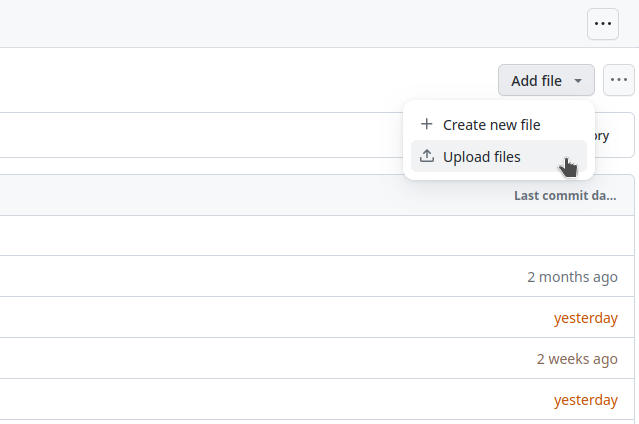
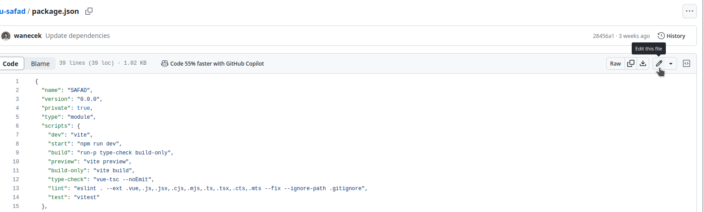

# SLU SAFAD

| Sustainability Assessment of Foods and Diets

A web-based implementation of the SAFAD model developed by Röös et al. (in
press) to benchmark sustainability impacts of diets.

## Common Tasks: How To

### Upload new input files

**From GitHub.com:** Go to [`src/default-input-files`](src/default-input-files)
and, in the top-right corner, press the "Add File" button and select "Upload
files". You will then be redirected to a page where you can upload the new files
which will replace the old files. Remember that the name of the file is
important, as is the order of the columns in the file. Files that you do not
upload will remain unchanged (e.g. if you upload `SAFAD IP Recipes.csv`, that
file will be replaced, and all other files remain unchanged).



**From CLI:** Update the file in `./src/default-input-files/`, stage, commit and
push.

### Update the version

**From GitHub.com:** Open the file [`package.json`](package.json) and press
the edit-button (a pen). In this json file, you can change the row that reads
something like:

```json
{
  "version": "1.0.1",
}
```

Be careful to keep the quotes (i.e. `"1.0.1"` and not `1.0.1`) and the comma at
the end of the line (i.e. `"version": "1.0.1",` and not `"version": "1.0.1"`).



**From CLI:** Either edit package.json directly, or use `npm version
[patch|minor|major]`.


## Project Structure

The project relies on extensive processing of the input data, some of which can
be found in the `./data-preprocessing/` directory. The majority, however, are
internal R-scripts and excel documents, as described in the above-mentioned
paper.

The implementation of the website, along with [the input
files](./src/default-input-files/) can be found in the [`./src/`](./src/)
directory, with the main logic being inside the [`./src/lib/`](./src/lib)
folder.

Some important files are:

- [rpc-reducer.ts](./src/lib/rpc-reducer.ts): The logic that breaks down a food
to its fundamental ingredients (and their amounts), along with transport,
processes, and packaging.
- [input-files-parsers.ts](./src/lib/input-files-parsers.ts): Parsing of csv
files to internal data formats. Useful to see which columns are used.
- [impact-csv-utils.ts](./src/lib/impacts-csv-utils.ts): Converting the internal
representations of results to csv-files, where e.g. headings are set and
columns defined.
- [ResultsEngine.ts](./src/lib/ResultsEngine.ts): Strings together most of the
logic to compute impacts of foods.
- [origin-waste-row-factors.ts](./src/lib/origin-waste-row-factors.ts):

One way to better understand what is going on in each file may be to look at the
test files (same names, but ending with `.test.ts` instead of just `.ts`).

## Technologies

The front-end uses [Vue](vuejs.org/) as the main framework, together with
TypeScript. These tools all require a working installation of
[node](https://nodejs.org/en) and a package-management system (e.g. npm,
included when installing node).

### Tooling

#### Recommended IDE Setup

[VSCode](https://code.visualstudio.com/) +
[Volar](https://marketplace.visualstudio.com/items?itemName=Vue.volar) (and
disable Vetur) + [TypeScript Vue Plugin
(Volar)](https://marketplace.visualstudio.com/items?itemName=Vue.vscode-typescript-vue-plugin).

#### Project Setup

```sh
npm install
```

### Compile and Hot-Reload for Development

```sh
npm run dev
```

### Type-Check, Compile and Minify for Production

```sh
npm run build
```

### Run tests

```sh
npm run test
```
